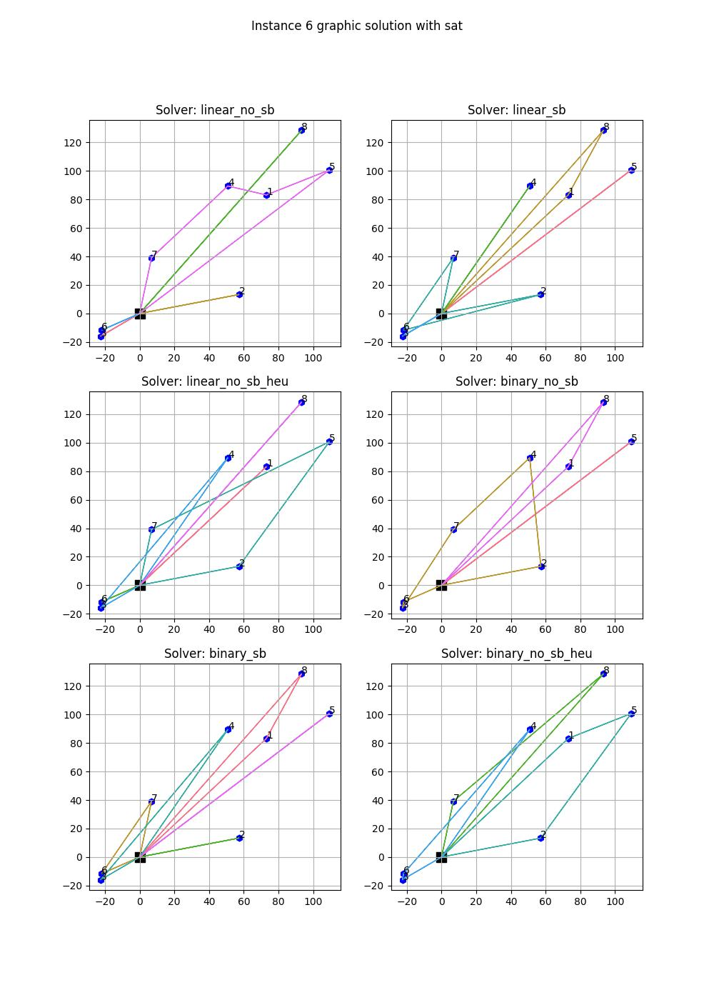

# Multiple Couriers Planning Problem
This repository contains the solution of the Multiple Couriers Planning problem, developed as a group project for the Combinatorial Decision Making and Optimization exam at Alma Mater Studiorum (Unibo) by Francesco Pivi, Matteo Fusconi, Shola Oshodi and Niccolò Marzi.

The problem consist in finding the shortest route for a number $m$ of couriers who have to deliver a number $n$ of items, without exceeding their load capacity. We solved this problem with four different approaches:
<li> Constraint Programming (CP) through the python API of Minizinc
<li> SAT through Z3 python library
<li> Satisfiability Modulo Theory (SMT) Z3 python library and with SMTlib
<li> Mixed Integer Linear Programming (LP) through PuLP python library

## Execution on Docker
After correctly installing docker: https://www.docker.com/products/docker-desktop/ <br>

- Firstly, build the docker image:<br>
<code>docker build . -t image_name</code> <br>

- Then run the container: <br>
<code>docker run -it image_name </code> <br>

- A suggested option that gives more flexibility is to start a bash environment inside the container:<br>
<code>docker run -it image_name /bin/bash </code><br>
If this last option is chosen, the commands in the following section will be needed. 

## Commands
Run with python the ```main.py``` file with the following optional arguments:

| Argument                        | Description                                                                  |
|---------------------------------|------------------------------------------------------------------------------|
| `-a, --approach`                    | Choose approach between **cp, sat, smt, smtlib, lp** (default: cp)| 
| `-n, --num_instance`             | Instance to solve. 0 for all instances (default: 0)                                         |
| `-t, --timeout` | Sets the timeout (s, default: 300)                                       |
| `-m, --mode`                | Choose between verbose mode (**v**) and silent (**s**) (default: v)|
| `-i, --input_dir`               | Select directory for input files (default: "./input/")                |
| `-o, --output_dir`               | Select directory for output files (default: "./res/") |

Example:

<code> python3 main.py -a sat -n 1 -m v</code><br>
Solve instance 1 with sat solver without fully printing the solution (verbose mode).

**Note**:<br>
The cp model is able to solve all the instances. Regarding the others, they can encode the model only on the first 10 instances (with an exception for MIP, that can do also 13 and 16).
It is recommended to run only instances for which a solution can be found.

## Graphic solution
A graphic solution has been developed, and it can be run with the following command:

<code>python3 graphic_solution.py -a smt -n 6</code>

This command supports the same arguments as above, except for "timeout" and "mode".
#### Example


## Check solution
The solution checker provided by the teachers can be run by the following command:
<code>python3 check_solution.py input res/</code>


## Authors
<li> Francesco Pivi
<li> Matteo Fusconi
<li> Shola Oshodi
<li> Niccolò Marzi